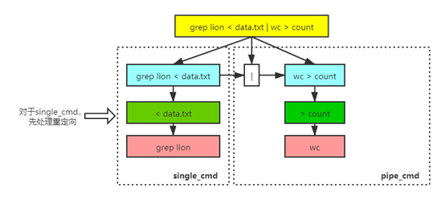
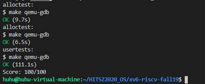
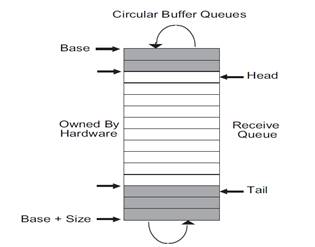

# 简介

本报告是针对MIT 操作系统课程6.s081/Fall 2019的xv6系统实验Lab1至Lab10的分析说明报告。在每个实验的设计方法中一般首先会介绍完成该实验所要了解的相关原理知识，接着会介绍完成该实验的代码的思路及流程。报告的最后给出了我的xv6项目完整代码的GitHub地址，以及我对学校OS实验的改进建议。报告中的内容仅是我个人总结和理解，如有任何错误的地方，还望多多理解。

# Lab1 Utilities

## 1.1 内容分析

第一个实验要求我们实现sleep, ping-pong, primes, find, xargs五个指令，这五个指令都是作为工作在user space中的程序执行。sleep使系统睡眠指定timer interrupt数，ping-pong使两个进程之间通过两个pipe实现互相通信，primes要求通过管道pipe实现质数筛选，find要求在某一路径中查找某个文件，xargs则要求实现Linux系统中xargs的**部分功能**，即将本行的参数同下一行参数合并起来执行xargs后面所跟的指令。

## 1.2 设计方法

### 1.2.1 sleep

sleep比较容易完成，只需从命令行参数中获取到sleep后面跟着的数字，调用系统函数sleep(x)即可。sleep的实现是kernel/sysproc.c中的sys_sleep函数，该函数使用到了kernel/trap.c中记录时钟中断数的ticks全局变量，时钟中断的介绍在xv6 book中4.4章节，大致讲时钟中断是由RISC-V CPU自带的硬件产生，其中断处理程序运行RISC-V的machine-mode中，且由于时钟中断每隔一段时间就会产生，为了不让时钟中断破坏xv6系统执行的一些关键操作，xv6为时钟中断设置了另外一套寄存器供其使用，并且让时钟中断来产生软件中断报告给xv6，以此来保证kernel的关键操作不被时钟中断打断。最后每当xv6处理一次时钟中断，kernel/trap.c中的ticks就会加1。

 

### 1.2.2 ping-pong

完成ping-pong需要掌握pipe管道的原理和功能。在本实验中首先应在一个进程中创建两个pipe，这两个pipe相当于都是单向的管道，一个parent_fd管道用来父进程发送消息给子进程，一个child_fd管道用来子进程发送消息给父进程；创建完两个管道后调用fork函数分裂为父进程和子进程，接着父进程向parent_fd写入”ping”,子进程读取parent_fd并打印相应信息，接着子进程向child_fd写入”pong”，父进程读取child_fd并打印相应信息。

要注意的点就是pipe在read的时候只有当所有的write端都被关闭时才会停止read，因此我们在使用pipe时最好将不需要用到的端先关闭了（特别是写入端），如果一个进程退出时没有关闭一个pipe的写入端，就可能发生另一个进程一直在pipe读取端等待信息的情况。xv6的exit()函数(kernel/proc.c中的exit()函数)会将该进程的所有已打开的文件描述fd都关闭掉，因此我们只要保证进程在结束时调用一次exit()函数就可以自动关闭已打开的pipe的写入端了。

### 1.2.3 primes

primes就是ping-pong的进阶问题，还需要了解质数筛选算法，以及dup()函数的作用，当初我在做该题时因为不清楚dup函数的作用导致半天都没想出来此题的思路。

该题的算法思想如上图，pipe就相当于不同层之间的通道，每层负责将从上一层得到的数字的所有整数倍值都给筛选掉，只将那些不是整数倍的数字再写入给自己的下一层，例如一开始将所有数字2~35输入给第一层，第一层拿到的第一个数字是2因此将所有2的整数倍数字都淘汰掉，这样第二层拿到的第一个数字是3…以此类推，最后每一层得到的第一个数字组合起来的集合就是所有质数。

### 1.2.4 find

find功能实现首先需要了解的是部分文件系统中的知识——dirent与stat。文件系统中文件夹也是被实现为单一的文件，其type为T_DIR，而一般的文件为T_FILE；xv6中的文件由inode及其附属数据代表，类型为文件夹的文件中的数据由dirent目录项组成，代表该文件夹中的各个文件，dirent由一个文件的inode号和其文件名组成（inode号相当于是磁盘中某个inode结构体所在inode数组中的下标）。而stat一般由fstat函数（kernel/fs.c中stati函数）从某个已打开的文件怎获取，stat中存储了该文件inode中的相应信息（dev, ino, type, nlink, size），其中type就是T_FILE,T_DIR,T_DEV中的一种（在find中不考虑T_DEV）。

 

了解了以上知识后实现find功能就思路很清晰，首先先获取到要搜索的路径名和文件名，通过open函数打开该路径（文件夹文件）且获得打开文件的文件描述符fd，再通过fstat获取该路径文件的文件信息stat，再从该路径文件中循环读取dirent，每读取到一个dirent，就将当前路径path和该dirent中存储的文件名拼接到一起组成子文件的绝对路径，通过该路径读取该子文件的stat信息（代码中调用user/ulib.c中的stat函数获取stat，stat与fstat的唯一区别，fstat要求传入的是文件描述符（文件已打开），stat只要求传入文件的路径即可），再判断该子文件的类型，如果子文件是普通T_FILE，则打印出该文件的完整路径，如果是文件夹文件T_DIR，则递归调用find函数，其中传入的path就是该子文件的完整路径。

### 1.2.5 xargs

xargs功能与实际Linux系统中的xargs功能不完全相同，xv6实验中的xargs只需要将第一行的指令参数与下一行指令参数拼接在一起再exec执行指令即可，而Linux系统中的xargs功能更加复杂，例如Linux中xargs可将多行参数合并为一行执行，而本实验的xargs只支持两行。比如xargs echo 12 (换行) 34 (换行) 56，真正的xargs应该是输出12 34 56 但本实验的要求是将第一行附加在其余行前面执行, 则结果就变成了12 34 (换行) 12 56

 

实现本实验中的xargs功能首先是将第一行参数保存下来，具体做法是通过malloc申请32个512字节的空间用于保存各行字符串，再设置一个大小为32的char型指针数组n_params用于保存第一行的各个参数，

// n_params是(从第二行开始)每一行与第一行进行拼接成的参数列表

  char *n_params[MAXARG];

  // 先将第一行的参数复制到n_params

  for (int i = 1; i < argc; i++)

  {

​    n_params[i - 1] = argv[i];

  }

接着从输入的第二行开始，对第n行：

将第n行的字符串进行切分得到第n行的各个参数，将这些参数附加到n_params中末端（即拼接在第一行参数的尾部），最后调用fork创建出子进程，在子进程中调用exec系统函数执行由“第一行的命令及参数”与“第n行参数“拼接在一起的命令参数n_params。

if (fork() == 0)

{

  exec(command, n_params);

  exit();

}

## 1.3 实验结果

# Lab2 Shell

## 2.1 内容分析

第2个实验要求完成一个基础的shell功能，限制是不能使用malloc函数。xv6自身的sh功能是通过构造几种cmd结构体组成的“cmd树“来实现的，例如下图：

xv6的sh实现主要思想是首先通过parseline(user/sh.c)函数将用户输入的一行参数解析为cmd树，然后再调用rumcmd函数去递归下降式地执行该生成的cmd树，本实验的代码可以借鉴上述思想。

## 2.2 设计方法

借鉴kernel/sh.c中的思想，不过我们不可使用malloc函数，意味着原本sh.c中的构造cmd树的思想不再适用，此时我们又可参考编译原理构造语法树生成中间代码的思想，我们既可以等待语法树构造完毕后再递归下降式地遍历语法树生成中间代码，也可以在构造语法树的同时就将中间代码生成出来。因此，我们可以像kernel/sh.c中构造cmd树的同时去执行相应指令即可，而不必等待cmd树构造完毕后再去执行该cmd树。同时也要注意到本实验并不要求我们实现sh的所有功能，只需要实现一般的命令执行、输入输出重定向、pipe管道即可。

设计思想如下：

将输入的一串字符串看作是 "single_cmd | single_cmd | ..." 即多个single_cmd通过pipe连接起来, 因此把不包含pipe的cmd看作是单个cmd, 把包含pipe的cmd看作是多个 “单个cmd” 的组合体；将pipe_cmd看作是 "single_cmd | pipe_cmd"以此递归下去, 函数每次处理一个single_cmd即可；

对于single_cmd, 将其看作一个command与params以及其它重定向语句组合而成, 即single_cmd = command + params + redir；那些重定向语句只对当前进程有效, 并且重定向语句要先处理, 之后再调用exec执行command与params；在处理重定向语句时，找到重定向语句并执行, 先找'>','<','>>'三个标识, 找到后再取得跟在这些符号后面的文件名，需要说明的是, 在本实验中'>>'与'>'效果相同(sh.c中也将'>>'与'>'处理的语句相同)。

## 2.3 算法分析

在主函数中：

\1.   在user/nsh.c中首先打开标准输入0，标准输出1，标准错误输出2；

\2.   循环读取用户输入的一行命令到缓冲区buf中（若读取失败则退出循环）：

1)   将buf中最后一个有效位置上的换行符’\n’丢弃(设置为0)；

2)   调用fork创建子进程，在子进程中：

a)   切分buf，将buf字符串中各个符号按空格切分出来并存储到char指针数组args中（例如将”A < B | C”切分为”A”,”<”,”B”,”|”,”C”）

b)   用切分出来的参数数组调用run_pipe_cmd

3)   调用wait(0)等待子进程的完成，回到第2.步

\3.   主函数结束

 

在run_pipe_cmd(int argc, char **args)中：

\1.   找到第一个’|’字符在args中的下标为i；

\2.   如果没得到字符‘|’（说明没有pipe），则调用run_sing_cmd(argc, args)即按照single_cmd去处理该cmd；

\3.   否则，将args[i] = 0即清除掉’|’，（之所以清除掉这个，是因为exec要求最后一个参数的字符串指针的下一个指针需要是0）：

1)   创建pipe管道p；

2)   调用fork分裂为父子进程，在子进程中：

a)   close标准输出1；

b)   调用dup(p[1])，将管道p的写入端置为子进程的标准输出；

c)   关闭原来的p[0]和p[1]；

d)   调用run_sing_cmd(i, args)；

3)   在父进程中：

a)   close标准输入0；

b)   调用dup(p[0])，将管道p的输出端置为父进程的标准输入；

c)   关闭原来的p[0]和p[1]；

d)   调用run_pipe_cmd (argc - i - 1, args + i + 1)；

\4.   run_pipe_cmd函数结束；

 

在run_single_cmd(int argc, char **args)中：

\1.   循环执行try_to_redir(argc, args)，直到try_to_redir返回负数；

\2.   接着再找到第一个不为0的args中元素的下标（即不为空指针的元素）

\3.   调用exec执行指令；

 

在try_to_redir(int argc, char **args)中首先在字符串指针数组args中找到’>’,’<’,’>>’三种字符其中一种，若未找到则返回-1，找到第一个时就停止继续查找；若是’>’符，则函数关闭标准输出1，再open跟在’>’符后面的文件；若是‘<’符，则函数关闭标准输入0，再open跟在’<’符后面的文件；若是’>>’则和’>’处理相同；接着返回1代表此次处理成功。

## 2.4 实验结果

# Lab3 Allocator

## 3.1 内容分析

实验的要求有两个：一是解决xv6原有的file结构体静态分配内存空间（使用了固定大小的数组）导致最大同时打开的文件数量被限制为NFILE的问题；二是xv6已经有的buddy allocator的sz_info结构体中，为每个块都指定了1位的alloc空间，但其实可以每一对伙伴之间用1位alloc，这样就可以使原来的alloc占用的空间缩小为二分之一的问题。

## 3.2 设计方法

在伙伴系统中，空闲空间首先从概念上被看成大小为的大空间。当有一个内存分配请求时，空闲空间被递归地一分为二，直到刚好可以满足请求的大小（再一分为二就无法满足）。这时，请求的块被返回给用户。例如下例，一个64KB大小的空闲空间被切分以便提供7KB的块。

伙伴系统的最大功能在于块被释放的时候时，如果将这个8KB的块归还给空闲列表，分配沉痼会检查其“伙伴”是否空闲，如果是，就合并这两块。这个递归合并过程继续上溯。直到合并整个内存区域，或者某一个块的伙伴还未被释放。

 

在xv6中，伙伴系统是由一系列sz_info构成的，每个sz_info的结构如下：

每个sz_info负责管理**型号为k**（型号为k的块的空间大小为*16KB，k从0开始一直到一个最大值MAXSIZE）的所有块的信息， 其中free是一个双向链表，其中每个节点代表了该型号k的空闲块的物理地址，alloc和split则都各自指向一片空间，其中数据的各位代表着其管理的某个型号k的块的状态，例如：第i个型号k的块已经被分配了，而且被分割split了，则alloc和split所指向的空间的第i位就为1。这里第i个型号k的块，其实就是该块的首地址减去buddy allocator管理的空间首地址bd_base再整除型号k的块大小的商。

 

在知道单个sz_info的代表的含义后，就能很清晰地明白xv6系统中整个buddy allocator的结构，如下图：

buddy allocator中的sz_info数组中第i个sz_info就负责管理所有型号为i的块，任何一个块被标记为split后就会在下层sz_info中被进一步管理，而xv6中允许的最小块大小为16B即型号0的块。

在xv6的buddy allocator初始化的时候系统分配的物理内存并不一定是16字节对齐或者刚好是大小，因此在初始化的时候会将伙伴系统的内存首地址向后移动到第一个十六字节对齐的位置作为首地址bd_base，若不是大小则在初始化的时候会将内存大小扩展到第一个满足，而系统允许的最大块的型号就为N-1（即最大的块大小为*16B）。

同时buddy allocator在完成内存空间的初始化后，还会将前面部分的空间作为sz_info数组以及每个sz_info中alloc和free字符数组的存储区域，为了让这部分区域不被使用，伙伴系统在初始化时就将这部分区域在各个层次的sz_info同时标记为已分配和已切分的状态（kernel/buddy.c中bd_mark_data_structures函数）；

而在伙伴系统管理的内存空间的末尾部分，由于之前的内存空间初始化时末尾部分可能会超过实际分配的内存，因此也需要将这部分的内存空间在伙伴系统中sz_info的各个层次上同时标记为已分配和已切分的状态（kernel/buddy.c中bd_mark_unavailable函数）。

在其余内存空间都配置好后，伙伴系统就会开始初始化用户所能使用的内存空间（kernel/buddy.c中bd_initfree函数），对于这段内存空间，其最坏的情况发生在空间的开始和空间的末尾，因为在空间内部的区域buddy allocator只需分配型号最大的块即可，而在空间的两端存在空间碎片就需要不断细化进入下层sz_info（越下层的sz_info管理的块就越小），直到到达能管理这些空间碎片的sz_info为止。例如下图：

## 3.3 算法分析

要解决第一个问题比较简单，就是在kernel/file.c中删除掉原来ftable中设置的file数组，并在filealloc函数中将原来的“寻找一个空闲的file作为将要返回的file”改为“调用bd_malloc函数分配一个sizeof(struct file)的空间f，并将该f所指向的内存初始为全0，最后将该f作为filealloc函数的返回值”。在修改完filealloc函数后还需修改fileclose函数，就是在fileclose函数中“将传入的file结构体中的ref置为0，type置为FD_NONE”的后面添加“调用bd_free函数对file结构体的内存空间进行释放”的操作即可。

 

要解决第二个问题，首先要改变原来的“为每个块都分配一位alloc”的情况中使用的bit_isset，bit_set，bit_clear三个函数，在这里我新建了三个函数bit_isset_alloc，bit_set_alloc，bit_clear_alloc，代表着针对sz_info中的alloc而新建的三函数。原来的bit_isset，bit_set，bit_clear函数的作用分别是在指定的内存空间中判断某位是否为1，设置某位为1，设置某位为0；而新建的bit_isset_alloc，bit_set_alloc，bit_clear_alloc函数的作用则是将传入的第index位看作是之前的第index/2位，即假如想要设置第12位为1，则bit_set_alloc将会设置指定内存空间中的第6位为1。

 

接下来的工作便是将之前buddy allocator中涉及alloc的地方都需要进行修改，首先是bd_print中有一处涉及打印alloc数组，由于alloc大小减半，因此需要将之前调用bd_print_vector中的代表alloc长度的值NBLK(k)减半，改为NBLK(k)/2即可。

其次是将bd_malloc函数中对alloc调用bit_set的代码全修改为调用bit_set_alloc，将bd_free函数中对alloc调用bit_clear, bit_isset, bit_set的代码改为调用bit_clear_alloc, bit_isset_alloc, bit_set_alloc，将bd_mark中对alloc调用bit_set的代码改为调用bit_set_alloc。

 

在将所有对alloc的操作改为用相应的bit_isset_alloc，bit_set_alloc，bit_clear_alloc函数后，还需修改的就是bd_initfree_pair函数。bd_initfree_pair函数被用于当一对“伙伴”其中一块被占用而另一块空闲，需要将空闲的块压入型号k的sz_info的free链表的情况。未经修改的xv6伙伴系统在该函数中是通过获取到两块对应的alloc值，如果这对“伙伴”的alloc值不相同则代表一块被占用而另一块空闲，因此再判断两块的alloc值，将alloc为0的块压入到对应sz_info中的free表。

修改后的bd_initfree_pair只需要判断一对“伙伴”的对应的alloc值是否为1，之所以只需要判断是否为1，是由于修改后的alloc值代表的是一对“伙伴”之前对应的两个alloc值的异或。在判断出一对“伙伴”存在需要free的情况后，还需判断出哪个伙伴是空闲的。这个问题解决办法是给bd_initfree_pair传入要free的内存空间区域[left, right]，这样我们便可以判断一对“伙伴”中哪个块对应的内存空间完全包含于[left, right]之中就应该被压入到sz_info的free链表。

 

最后，还需在bd_init中将之前对alloc数组分配的大小由sizeof(char)* ROUNDUP(NBLK(k), 8)/8，改为sizeof(char)* ROUNDUP(NBLK(k), 16)/16。16个块对应一个char，因此需要将块数量按照16对齐，再按照16个块1个char去分配空间。

 

## 3.4 实验结果

# Lab4 Lazy Page Allocation

## 4.1 内容分析

该实验要求实现Lazy Allocation功能，就是在进程申请内存的时候操作系统并不立马为其分配内存空间，而是等到进程真正要使用这片内存区域的时候才为其分配空间。通过这种“吝啬”的分配来让操作系统能腾出更多的内存运行更多的进程。

当然本实验第一个要求是实现一个打印页表的功能vm_print，这个函数只要了解了PTE的功能以及原理，同时阅读了xv6 book中第三章关于xv6的PTE实际实现就可以很快完成。具体来说，在xv6中使用了三级页表的结构，例如一个虚拟地址va，共64位，前25位没有使用（作为保留位），后12位作为页内偏移量（即xv6中一页也是4KB），剩下的27位就是三级页表所要用的三个VPN了，例如下图中L2,L1,L0就分别代表了在各自页表中的下标（取自xv6 book）：

本实验的第二个要求就是实现Lazy Allocation，最后所需写的代码较少，不过要想通过所有usertests的话最后还应针对下图的六个要求分别做修改才行。

Lazy Allocation主要的实现在kernel/trap.c中，在trap中需要我们正确处理因为缺页造成的trap。要求我们在缺页处理中才进行真正的物理内存分配(kalloc())并插入相应PTE到该进程的页表中(mappages())。

## 4.2 设计方法

对于第一个设计vmprint打印出页表内容就不详细介绍其实现方法，大体做法只要按照PTE的格式打印出相应值即可，如果遇到PTE_V为1，但是PTE_X, PTE_W, PTE_R标志都为0的话就代表该PTE指向的是一个下级页表而不是实际数据页，对于这种指向下级页表的PTE，我们需要递归调用vmprint来进入该下级页表继续打印。当然其实我们也可以记录当前页表的层级（因为xv6是采用的三级页表结构，因此除了第三级页表，前两级页表指向的都是下一级页表的页）。

对于Lazy Allocation，我们首先需要将kernel/sysproc.c中的sys_sbrk函数中的growproc(n)函数调用删除，与之代替的是直接增加当前进程的内存大小(myproc()->sz)，并返回内存增加之前的大小。

接着需要在kernel/trap.c中实现其核心功能。首先在RISCV的scause寄存器组来存放的是造成当前trap的原因，因此我们应在usertrap中判断scause的值，若scause值为13或15，就代表是缺页错误，此时就需要内核为其分配真正的物理内存。通过kalloc函数申请新的一页，再将该页的内容初始化为0。接着需要获取stval寄存器中的值，该寄存器中存放了此次造成此次缺页错误的将要访问的虚拟地址va，获取到该虚拟地址后再调用PGROUNDDOWN宏定义将其转换为所在页的首地址，接着我们通过调用mappages将va指向新分配的物理内存首地址，并将这个映射保存为PTE插入到该进程的页表中。

理想情况下，通过在kernel/trap.c中对缺页错误的处理我们应该能够正确运行xv6了，可要想完成实验，还需修改以下几处地方（分别对应上图中的五点要求）：

第一条要求：handle negative sbrk() arguments.

对于该条要求，只需在sys_sbrk中判断当n为负数时，正确调用uvmdealloc回收内存即可；

 

第二条要求：Kill a process if it page-faults on a virtual memory address higher than any allocated with sbrk().

对于该条要求，需要在kernel/trap.c中处理缺页错误时判断一下虚拟地址va是否超过了当前内存拥有的合法内存大小p->sz，如果超出了这个范围，则应直接exit(-1)结束该进程；

 

第三条要求：Handle fork() correctly.

对于该条要求，需要在kernel/vm.c中的uvmcopy函数中将之前的两个报告页面不错在的panic给注释掉，改为continue；即在fork中发现父进程的某个内存缺页，则子进程不用去管，因为如果子进程要访问这些页面，则到时候自然会报缺页错误交给我们已经设计好的usertrap函数处理。

 

第四条要求：Handle the case in which a process passes a valid address from sbrk() to a system call such as read or write, but the memory for that address has not yet been allocated.

对于该条要求，需要在kernel/vm.c的walkaddr函数中判断下walk返回的pte，如果pte为0或者pte的有效位PTE_V为0，则代表此时要访问的虚拟地址还未分配物理内存，因此需要我们做类似之前在trap.c中的usertrap函数的操作，即kalloc申请新页，之后再调用mappages创建va到新页的pte并插入到当前进程的页表中。

 

第五条要求：Handle out-of-memory correctly: if kalloc() fails in the page fault handler, kill the current process.

对于该条要求，就是在我们用kalloc申请新的物理页内存时，如果kalloc返回空指针，即代表申请内存失败，需要直接调用exit(-1)结束当前进程。

 

第六条要求：Handle faults on the invalid page below the stack.

对于满足该条要求，我上网查了下别人的做法，最后的操作是在解决缺页错误时，需要判断下虚拟地址va是否小于当前进程的trapframe中的sp指针，xv6中栈是向下增长的，即sp所代表的栈顶实际是栈中地址最小的，因此如果va要访问的虚拟地址低于sp则需要exit(-1)结束进程。（对于这第六条的操作我也不太确定，因为根据xv6 book中在栈的下面是data段和text段，如果用户想要访问data段的时候不就va也小于sp了？）

 

完成以上六个要求的修改后，代码就应该能通过usertests。

## 4.3 实验结果

这个实验的make grade中第一个测试是关于vmprint的，这个测试完全是硬编码检测（就是比较两个字符串是否完全相同，我反复检查了很久才发现是空格的位置不对），因此需要我们格外仔细。最后的结果如下图：

# Lab5 Copy on Write Fork for xv6

## 5.1 内容分析

本实验中要在xv6系统中实现copy on write的功能，就是当fork函数被调用时，系统并不会立即为子进程分配新的物理内存且复制父进程的物理内存中的数据，而是让子进程先暂时就使用和父进程相同的物理内存空间，只不过这部分物理空间全部被标记为“只读”状态，当子进程或父进程需要写入物理内存时才将要写入的物理内存页新复制一份，并将相应的虚拟地址重新映射到该新复制的物理页上，并组成新的PTE插入到进程的页表中。

## 5.2 设计方法

实现Copy on write（写时复制）功能，就得首先考虑物理内存的多重映射问题，之前的xv6的每页物理内存都最多只映射到某一个进程的某一页虚拟页，因此当该进程释放掉该虚拟页时就应该释放掉该物理页。然而当实现写时复制的功能后就会存在分布在不同的进程的多个虚拟页映射同一个物理页的问题，这样的话就应当在最后一个映射到该物理页的虚拟页被释放掉后才能将该物理页释放掉，因此需要为每个物理页记录当前有多少个虚拟页映射到它，当映射数量降为0时才应当将该物理页真正地释放掉。

 

kernel/kalloc.c是xv6内核管理物理内存的文件，该文件中的kmem上记录了当前物理内存的使用情况。因此为了实现上述记录功能，在kmem中新建一个uint* ref_count指针来代表各个物理页的引用数量，例如ref_count[100]就代表了第100页的引用数量。因此我们需要在kinit()初始化函数中完成对该部分区域的划分和创建，之前的kmem管理的物理内存从end到PHYSTOP，添加了ref_count后，kem管理的物理内存范围就变成了从end+pa_offset到PHYSTOP，其中pa_offset是计算PHYSTOP到end一共有多少物理页并且每个物理页占sizeof(uint)的ref_count空间，因此

在将存储ref_count的内存区域创建出来后，我们还应修改kalloc.c中的其它函数以实现ref_count的记录引用数功能。

 

首先是kfree函数的修改，之前的kfree函数是将传入的物理地址的页添加到kmem的freelist中，代表该页是空闲的已经可以重新利用。为了实现引用数功能，将原来的kfree函数改名为k_real_free，而新建一个kfree函数。新kfree函数同样接收一个物理地址pa，只不过会先计算该物理地址所在页的物理页框号PPN，再将ref_count[PPN]减1，代表该物理页的引用数减1，之后再判断引用数是否为0，若为0则调用k_real_free将该物理地址真正地free掉。

 

新建一个klink函数，该函数接收一个物理地址pa，作用是将该pa对应物理页的引用数加1。并且应在kalloc函数中调用一次klink函数，代表对新创建的页的引用数加1。

 

至此，我们完成了对xv6内存管理系统的修改，现在的xv6内存管理系统便可支持多个虚拟页映射至同一个物理页的情况，并且当没有虚拟页映射物理页时才将该物理页释放掉。

 

接下来就是对fork过程中涉及到内存的部分的修改，以及页写入错误的处理。首先将PTE中未使用的标志位——第8位作为PTE_COW，PTE_COW若为1代表该物理页是被多个虚拟页映射，正处于写时复制的状态。

fork创建子进程的过程中会调用uvmcopy函数(kernel/vm.c)来将父进程的物理内存以及页表复制到子进程。之前的uvmcopy函数，对于父进程的每一物理页，都会为子进程分配(kalloc)一个新的物理页，并调用memmov将父进程的物理页中的数据复制到子进程的新物理页中，之后再调用mappages将新的物理页以及该虚拟地址插入到子进程的页表中，且该新物理页的标志位和父进程的对应物理页保持不变。而在新的uvmcopy函数中，不再为子进程分配新物理页，转而代之的是首先将该物理页在父进程页表中的PTE项的PTE_W清0，PTE_COW置为1，接着直接将父进程的物理页和对应的虚拟地址插入到子进程的页表中，PTE的flags保持和父进程的相同。

 

copyout函数(kernel/vm.c)也需要修改，copyout函数功能是将内核物理内存中（kernel memory)的某个地址src的数据传输到某个进程的某个虚拟地址dstva（user memory）。之前的copyout函数做法是首先找到该虚拟地址的虚拟页首地址va0，再通过walkaddr函数在该进程的页表中查找到va0对应的物理地址pa0，再调用memmov从src传输数据到pa0即可。修改后的copyout函数应首先取出该va0的页表项pte，再判断页表项的PTE_COW是否为1，若为1则代表该va0目前的物理页是写时复制状态，需要先将该物理页复制一份再写入。因此在这里copyout会首先调用kalloc申请新物理页mem，再将pa0中的数据复制到mem，再将va0映射到mem上，并创建PTE_W=1且PTE_COW=0,其余标志位同旧物理页对应PTE标志相同的PTE插入到进程的页表中。之后便可进行copyout操作。并按照上述循环，直到copyout将指定长度的数据传输完毕。

 

最后要修改的就是usertrap函数(kernel/trap.c)，在写入一个PTE_W=0的页时，会触发scause=15的中断，因此在usertrap判断r_scause()是否为15，若等于15就需要进行同copyout函数做的那样完成写时复制操作。

 

在完成上述功能的修改后，xv6系统便具有了写时复制的功能，理论上在物理内存大小不变的情况能够执行更多次fork调用进行子进程的创建。

## 5.3 实验结果

# Lab6 user-level threads and alarm

## 6.1 内容分析

本实验要实现的任务有两个，第一个是线程切换，需要我们实现在user空间中创建多个线程并在线程之间正确切换的功能。第二个是实现系统定时函数的功能，就是给系统设定一个时间间隔n以及函数fn，让系统每隔n个时钟中断就执行一次函数fn，注意fn也是user function，因此整个过程会经历user ->kernel ->user(函数fn) ->kernel ->user的过程。

## 6.2 设计方法

### 6.2.1 uthread

要实现线程的切换首先要保证在进程切换时能够安全地处理寄存器的使用问题，首先需要了解RISCV寄存器的结构，如下图：

在RISCV中，通常会出现a调用b的情景，这时候a就是Caller调用方，b就是Callee被调用方，在上图最右边一栏”Saver”代表了对应寄存器由谁来负责保存：

该寄存器由调用方自己负责保存，被调用方可以修改这些寄存器而不用保护；

该寄存器由被调用方负责保存，在退出被调用方时，被调用方需要保证这些寄存器的值没被更改；

 

通过上面的RISCV寄存器知识，我们就知道了在线程切换时应该要保存/恢复哪些寄存器，就是s0-s11和sp，并且还应额外保存/恢复ra寄存器的值，这样才能使线程在切换工作完成后能正确地返回到自己应该执行的函数func的起始位置。

其实在xv6的进程切换的代码中已经有了现成的寄存器保护/恢复的代码，那就是kernel/proc.h和kernel/switch.s，在这两个文件中向我们展示xv6在进程切换时是如何保存/恢复ra, s0-s11寄存器的，因此我们可以直接借鉴。

 

因此为了实现线程切换功能，只需要：

在user/uthread.c中创建新的结构体context，其中存放有14个uint64代表着14个要保存的寄存器值，并在thread结构体中添加一个context属性。

在线程创建的函数uthread_create中，借鉴kernel/proc.c中的allocproc函数，对context字段初始化，并将其中的ra值设置为func函数指针，将sp值设置为该线程的STACK空间的栈底。

在线程切换的函数thread_schedule中，添加调用thread_switch的代码，传入的两个参数将会被保存在a0和a1寄存器，第一个参数是当前线程的context，第二个参数是下一个线程的context，代表从当前线程切换到下一个线程。

最后要完成thread_switch.s的汇编代码，该文件完成将ra,sp,s0-s11寄存器的值存储在当前线程的context中，并将下一个线程的context中的ra,sp,s0-s11的值取出到对应寄存器中。该部分代码直接借鉴kernel/switch.s即可。

### 6.2.2 alarm

第二个任务的代码量较少，重要的是理解整个alarm执行的过程，示意图如下：

trampoline.s完成用户模式和内核模式之间的转换。每次发生用户模式和内核模式转换的时候，trampoline.s会将user space的相应的寄存器的值保存到当前进程的trapframe中，trapframe还保存有四个kernel开头的内核寄存器的值，当切换到内核模式时候会将这四个寄存器加载到对应寄存器中，以此完成由用户模式到内核模式的切换，这里需要注意satp是保存一级页表首地址的寄存器，当satp切换后就代表使用的虚拟地址不再是user space了而是kernel space（xv6中kernel和user的虚拟地址空间是分开的，不像Linux是kernel和user共存于同一个虚拟地址空间）。从内核模式到用户模式的操作差不多，就是保存四个kernel开头的寄存器的值，再加载之前保存的trapframe中的用户寄存器的值到相应寄存器。

 

执行整个定时函数的过程如下，当一个时钟中断发生时，会由用户模式切换到内核模式并执行usertrap，在usertrap中将一个时钟计数加1，如果时钟计数满足设定的时钟间隔，在此次usertrap处理过程中就会保存当前的trapframe到old_trapframe中，并之后返回到用户模式中定时函数的首地址并执行定时函数，定时函数执行完毕后调用sigreturn进入内核模式，内核模式下sys_sigreturn将之前的保存的old_trapframe恢复到trapframe中并将时钟计数重置为0以等待下次再次执行定时函数，并随后返回到用户模式中上一次被中断的用户指令处，继续执行下一条用户指令。

 

按照上面的过程在proc.h的struct proc中增加一个old_trapframe的结构体，并且设置一个当前时钟计数ticks和时钟间隔tick_interval，以及一个代表是否正在执行定时函数的标志位inhandler(防止在执行定时函数时，被时钟中断导致进入新的定时函数)，同时还设置一个保存定时函数的首地址指针handler。设置完相应结构体后，就可以按照上面描述的过程去修改usertrap函数和相应sys_sigalarm和sys_sigreturn函数即可。

## 6.3 实验结果

# Lab7 locks

## 7.1 内容分析

本实验要求解决由于锁争用而造成xv6系统并行化程度不高的问题。主要有两处锁争用场景需要改善，一是kernel中内存管理的kmem同一时间只能供一个cpu使用，二是磁盘块缓冲区buffer cache同一时间也只能供一个进程使用。

## 7.2 设计方法

解决kalloc的锁争用，只需要为每个cpu都分配一个kmem即可，即每个cpu拥有一个自己的内存空闲页的链表freelist，并且每个freelist对应一个spinlock，即每个cpu的kmem对应一个lock。当一个cpu的freelist没有空闲页的时候就到其它cpu的freelist中去获取。

按照上面的思想去修改kernel/kalloc.c中的对应的代码即可通过kalloctest。

 

kernel/bio.c文件是xv6系统中管理硬盘块缓存的地方，其中bcache拥有一片缓存区域buf以及一个锁lock，同时还需注意bcache将buf组织成一个双向循环链表，该链表有一个头结点head方便搜索buf。按照之前的结构，多个进程同时想要使用bcache的话，必须抢用一个lock，因此效率非常的低。为了提高并行程度，将bcache从单独一个链表(一个head)改变为用多个链表(多个head)，即多个bucket。例如下图：

每当一个进程想要获取设备号为dev，块号为blockno的磁盘块时，bcache会将blockno进行哈希计算，计算出该块号对应的桶号，并申请该桶的lock，获取到该桶的lock后就可在其中的双向链表中搜索，看bcache是否已经缓存了该块。如果缓存有该块（dev和blockno都符合，则使块的引用数加1，返回该块；如果在桶中没有找到，则就去寻找一个空闲的缓存块buf作为该磁盘块的缓存。如果自己桶中没有空闲的buf（refcnt等于0），就去其它桶寻找空闲块，将找到的空闲块从原来的双向链表中分离出来，插入到自己桶双向链表的头部。

 

同时当用户想要释放掉一个块时，也是先根据blockno哈希计算出bucketno再到对应桶中搜索对应的块，并使该块refcnt减1，如果refcnt减为0则将该空闲块从双向链表中取出再插入到头部。注意，搜索空闲块从head->next开始从前往后搜索，搜索是否已经存在的块则是从head->prev开始从后往前搜索。

 

## 7.3 实验结果

# Lab8 file system

## 8.1 内容分析

本实验要求有两个：一是增大xv6文件系统中的file最大大小限制；二是实现软连接symbolic link功能；

在操作系统中软连接和硬链接的区别主要是，硬链接不会创建inode，只会将inode的link数加1，软连接会新建一个inode，相当于新建一个文件，这个文件的类别是SYMLINK，类似于我们日常使用电脑中的快捷方式那样；并且硬链接只能是在同一个设备中创建链接，而软连接可以跨设备进行连接。

## 8.2 设计方法

### 8.2.1 Large files

在操作系统中，文件由inode及相关的数据块组成，例如下图（取自xv6 book）

在xv6中，dinode是inode在硬盘中的结构体，inode是inode中内存中的结构体。

对于第一个实验，我们要考虑的是inode中的addrs属性，addrs记录了文件各个数据块的块号，其中最后一块数据块被xv6用作一个目录块，意思是其中存储了文件其余的数据块的块号。inode中addrs长度为13，前12块为直接数据块，第13块是目录块。而xv6一个磁盘块的大小1KB，而一个块号占4B，因此目录块中最多存储256个块号，在这种设计下，xv6中一个文件最大大小为12+256=268块。

 

为了增大文件的最大容量，选择前11块作为直接数据块，第12块作为目录块，第13块作为一级目录块，一级目录块的含义是其中存储的256个块号指向的是256个二级目录块，因此在这种设计下，xv6中一个文件最大大小就可以达到11+256+256*256=65803块。

在了解以上思路后，其实在文件需要修改的地方主要就两处，kernel/fs.c的bmap函数和itrunc函数。当然首先应修改kernel/fs.h中的NDIRECT变量从12改为11。

 

bmap函数的功能是在给定文件inode的条件下，返回第n个数据块的块号。首先应在原来bmap函数的基础上增加对n在第267到第65802块（从第0块起）的判断，若是267~65802块，则首先应取出addrs中最后一块的块号，当然如果最后一块不存在就为其分配，调用bread函数从磁盘中读出该块的内容，再计算此数据块的所在二级目录块的位置，若二级目录块不存在也为其分配，调用bread读取内容，最终在二级目录块计算数据块的位置，最终读取出该块的块号，当然若数据块不存在也是需要为其分配。

 

itrunc函数的功能是释放掉一个文件在磁盘中的所有数据，在实验中需要在itrunc函数中增加对二级目录块结构的释放，大致操作是如果一级目录块存在，就取出其内容再遍历其中的每个存在的二级目录块，再读取二级目录块内容，遍历其中每个存在的数据块块号，调用bfree释放掉该数据块，遍历结束后再bfree该二级目录块，当所有二级目录块遍历结束后就bfree掉一级目录块。

 

### 8.2.2 Symbolic links

首先需要在xv6系统中注册symlink系统调用函数（包括在user/user.h, user/usys.pl, kernel/syscall.c等一系列文件中添加有关symlink的代码）。并在kernel/stat.h中添加新的inode类型T_SYMLINK，同时在kernel/fcntl.h中添加O_NOFOLLOW的open flag标志（用于在open文件时传入的flag），O_NOFOLLOW的作用是告诉open函数，如果将要打开的文件是SYMLINK类型，不需要进行递归打开，即不需要打开软连接所指向的文件，打开当前SYMLINK文件即可。

 

对于sys_symlink函数，该函数结束两个字符串target和path（都是文件路径），其中target是symlink将要指向的文件所在路径，而path则是新创建的SYMLINK文件的所在路径。函数大体思路是，首先调用create函数从path中创建新文件inode，接着调用balloc为新文件申请一个数据块，并将块号存入addrs[0]中，接着将target字符串通过memmov存入该数据块中即可。

 

接着就是要修改sys_open函数，在open函数中需要对inode的type以及传入的open flags进行判断，如果inode类型是SYMLINK类型并且传入的flags中O_NOFOLLOW标志位为0，代表着需要进行递归查找，找到软连接真正连接到的文件。

 

递归查找的函数为find_true_inode，该函数接受一个未被lock的inode，以及一个递归深度depth，设置递归深度的作用防止死循环，当depth大于10的时候便直接返回0，例如A->B, B->A，则open就可能由于找不到不是SYMLINK类型的文件而无限递归下去。在find_true_inode中，首先读取当前inode的第一个数据块，（因为之前在SYMLINK类型文件的第一个数据块中存储了目标文件的所在路径target），取出第一个数据块中的字符串数据，再调用namei函数从文件路径中读取出目标文件的inode块，接着需要从目标文件的inode块中判断文件类型，如果文件类型依然是T_SYMLINK，则需要再次调用find_true_inode并将depth加1，如果文件类型不是T_SYMLINK类型就直接返回该文件的inode。

 

## 8.3 实验结果

在grade-lab-fs文件中，我将bigfile测试的timeout（最大运行时间）从180调成了300，可能是因为虚拟机配置的内核数不够导致运行时间超时？总之之前的bigfile测试未能通过，调整时间限制后便能通过全部测试。

# Lab9 mmap

## 9.1 内容分析

本实验要求我们实现UNIX系统中的mmap内存映射功能，具体作用是将磁盘中的文件指定区间的数据直接映射到某个进程的虚拟空间中，并且允许同一个文件的指定数据空间映射到多个进程的虚拟地址，这些虚拟地址可以共享同一片物理内存也可以不必。

## 9.2 设计方法

在本实验中最后采用的设计是在fork时，父子进程的VMA映射使用的是同一片物理内存，也即是上图中的情况。在这种设计中就需要像之前Lab5 Copy on Write做的那样，为物理内存中的每页设置一个引用数ref_count，每当有一个进程有该页的引用，就需要将ref_count加1，而每次释放一个物理内存也只是让ref_count减1，最后当ref_count为0时才真正kfree掉该物理页。当然这部分kernel/kalloc.c的内容不是本实验的重点，因此不详细介绍。

 

本实验重点是要实现两个系统调用函数sys_mmap和sys_munmap，其中sys_mmap函数负责将指定文件fd全部内容映射到当前进程的某片虚拟地址空间中（本实验中mmap的参数addr和offset均为0），代表着sys_mmap自己决定所要存放的虚拟地址空间区域，并且一次映射就是将整个文件的数据空间进行映射。sys_munmap则是将给定虚拟地址addr以及长度len的虚拟空间的VMA映射给取消掉，并且如果某个文件的映射的空间VMA所占的虚拟页全部被unmap掉时，还需将VMA结构给free掉。下面介绍本实验中的VMA结构。

 

VMA(virtual memory area)结构就是负责记录一个进程的虚拟地址空间使用情况的结构体，在本实验中为每个进程设置了16个VMA结构体（kernel/proc.h struct proc），VMA结构体各字段属性如下：

// VMA结构体

struct VMA {

 int used; // used=1代表已经占用

 uint64 addr;

 int length;

 int flags;

 int prot;

 int npages; // page的数量,当page数量减为0时就需要file->ref减1

 struct file* file;

};

used代表该VMA结构体是否已被使用；addr代表该VMA所记录的虚拟地址首地址；length代表该VMA所用虚拟地址的长度；flags是MAP_SHARED或MAP_PRIVATE；prot是PROT_READ或PROT_WRITE；npages是为该VMA分配的虚拟页数量，在munmap中每unmap一页（无论有没有为该页分配真正的物理页），npages减1，当npages为0时，就应关闭该文件（fileclose）；最后file是指向所映射文件的指针。

 

接下来介绍sys_mmap主要实现思路。首先获取到传入的6个参数，分别是不会用到的地址addr，映射区域长度length，读取写入权限prot，共享/私有映射flags，文件描述符fd，不会用到的偏移量offset。接着根据文件描述符在当前进程proc中获取到该文件的file结构体指针。接着，从当前进程的静态VMA数组中找到第一个vma.used=0的空闲VMA，将该VMA的used设置为1，并赋值其余addr、length、flags等字段属性。接着调用filedup将文件的引用数加1。最后返回vma的虚拟首地址addr。

 

这里重点强调关于VMA中addr属性如何赋值，即如何决定将文件空间映射到哪个虚拟地址上。在xv6中最大虚拟地址MAXVA为1<<38，而为了避免和程序中一般会使用到的虚拟地址冲突，将VMA所管理的虚拟地址首地址VMASTART设置为1<<37，且设置每个VMA最大的虚拟地址空间大小VMASIZE为1<<20，因此我们最大可以分割出1<<17个VMA，但实际上在实验中为每个进程只分配了16个VMA，因为xv6中允许同时打开的文件数量最大就是16个，因此16个VMA在本实验中已经足够。

 

接下来介绍sys_munmap主要实现思路。munmap接受一个虚拟地址addr和长度length，首先将addr减去上面介绍的VMASTART再除以VMASIZE就得到了对应的VMA在当前进程VMA数组中的下标，得到VMA后，便从addr所在虚拟页的首地址开始遍历每一虚拟页（直到长为length的虚拟空间全部被覆盖）：对于虚拟页va，调用walk函数得到PTE，接着将VMA中npages减1代表unmap了1页，接着判断PTE是否有效，如果有效则得到其中的物理地址pa，如果MAP_SHARED在VMA中的flags被设置，那么就需要将该物理页写回磁盘（具体操作不介绍）。在上述遍历完成后，检查VMA的npages是否为0，若为0则还需要调用fileclose函数将文件的引用数减1。

 

在mmap和munmap函数实现完毕后，还需在trap中处理缺页错误，因为对于某个文件第一次被映射时，mmap是不会立即分配物理内存空间的，需要在缺页处理中申请新物理页，并从文件中的指定位置读取一页数据到该新物理页，具体操作和在Lab4 Lazy Allocation中的usertrap函数相同，因此不详细介绍，只不过在本实验中usertrap多了一个调用readi从磁盘中读取PGSIZE（1页）的数据到新建立的物理页mem中而已。

 

要通过本实验全部测试，只剩下一些细枝末节的工作。例如还需要在fork创建子进程时将VMA映射所覆盖的物理内存的每一页的引用数ref_count加1；还需要在exit时候将这些ref_count减1，如果减为0则直接free掉对应物理页。

## 9.3 实验结果

# Lab10 networking

## 10.1 内容分析

本实验主要要求有两个：一是完成E1000网卡驱动程序的接受和发送功能；二是完成socket套接字的接受udp, 读取, 写入, 关闭等功能。

本实验按照官网给的提示hints以及阅读E1000网卡驱动的datasheet中3.2.3, 3.2.6, 3.3.3, 3.3.4等章节基本上可以完成。

## 10.2 设计方法

### 10.2.1 Network device driver

要实现E1000网卡驱动程序中接受和发送，除了借鉴Hints之外还需了解以下E1000驱动知识：

在E1000驱动中，每接受或传送一个数据帧都是在一个循环缓冲队列中（所以有两条队列，接受缓冲队列和发送缓冲队列），也就是上图中的结构。该缓冲队列中每一条记录都是一个描述符Descriptor（Receive Descriptor和Transmit Descriptor），描述符中记录了接受数据或发送数据所要用到的相关信息。该循环缓冲队列主要有两个指针Head和Tail，其中Head和Tail之间的区域的描述符(白色区域)代表着还未被准备好的描述符（代表该描述符为空或者该描述符相关的数据帧正在发送中（on the flying）），而Tail到Head之间的灰色区域则是代表已经被硬件接收完毕或者已经准备好相关数据就等软件处理的描述符。

 

接受描述符如下图：

Buffer Address就是将接受的数据所要存放的物理内存地址，Status字段则是存放了该数据帧以及该描述符的相关状态（例如该描述符是否已被使用或者该描述符是否已经被硬件处理好可以使用）。下图是Status字段详细结构图：

这里需要重点说明的是一个描述符只有当它的数据被硬件接收完毕后才应该调用E1000驱动程序的e1000_recv函数来进行处理，而每当一个数据帧的数据被硬件接收完毕，即可以对其进行接收处理时，在Receive Descriptor中Status字段的DD标志位将会被置为1。

 

发送描述符如下图：

Buffer Address是已经准备好的数据物理内存首地址，在本实验中我们还需了解的字段是STA和CMD，STA就是Status字段，其中的DD标志位依然是待该描述符已经被硬件处理完毕就会被置为1。CMD是在发送过程中的一些参数设置，CMD字段结构如下图：

在网卡驱动的datasheet中有每个标志位的详细说明，在本实验中我们只需要了解RS字段和EOP字段，RS标志位是告诉硬件，当准备好该发送描述符后需要将Status字段中的DD标志位置为1，由于我们实验中要用到DD标志位来判断每个发送描述符是否准备好，因此RS需要被置为1；EOP标志位是代表着该数据帧是该网络层数据包的最后一帧，在本实验中我们并未涉及到网络数据包的分组，因此传输的每帧都是数据包的最后一帧，因此EOP需要被置为1。

 

还需要说明的是，在网卡驱动中为每个文件符还配置了一个缓冲区指针，例如下述代码：

\#define RX_RING_SIZE 16

static struct rx_desc rx_ring[RX_RING_SIZE] __attribute__((aligned(16)));

static struct mbuf *rx_mbufs[RX_RING_SIZE];

接受缓冲队列rx_ring中每个文件描述符都对应一个mbuf的指针，指向数据mbuf的存储地址，在mbuf中我们可以给数据加上或删去各种协议的头字段，mbuf的功能就是方便加载和删除各层协议的头字段的。

 

在了解完以上网卡驱动知识后，我们便可按照实验Hints的提示完成第一部分的实验。对于e1000_recv接受数据，大致思路就是，从接受缓冲队列中根据尾指针Tail加1再mod队列长度RX_RING_SIZE得到下一个要处理的数据帧的接收描述符tail_desc，再判断该描述符中DD标志位是否为1，（如果不为1则结束函数）如果为1，再获取到该描述符的mbuf，将该mbuf的长度调整为描述符中描述的数据长度，再调用net_rx交给上层协议去继续处理数据并接收即可。此时mbuf所代表的物理内存就代表已经被使用，因此我们还需为文件描述符分配新的接收内存区域，之后再将描述符中的addr地址指向新的内存区域，且描述符的DD字段清空为0即可。关于e1000_recv还需注意的是，在接收完一个数据帧后还需继续扫描接收缓冲队列rx_ring，继续获取下一个文件描述符，重复执行上述操作即可（直到遇到的描述符DD字段为0）。

 

对于e1000_transmit发送数据，大致思路和e1000_rec相似，这里不再赘述。

### 10.2.2 Network sockets

本实验中实现socket套接字功能需要完善四个函数的功能，在kernel/sysnet.c中的sockrecvudp, sockclose, sockread, sockwrite，首先需要了解的是socket套接字的结构体sock：

struct sock {

 struct sock *next; // the next socket in the list

 uint32 raddr;   // the remote IPv4 address

 uint16 lport;   // the local UDP port number

 uint16 rport;   // the remote UDP port number

 struct spinlock lock; // protects the rxq

 struct mbufq rxq; // a queue of packets waiting to be received

};

在xv6中对于所有打开的socket都存储在单向链表sockets中，sock结构体中next指针就是指向该链表中的下一个socket。在xv6系统中对于socket也是作为文件进行表示的，其文件类型为FD_SOCK，在fileread和filewrite中若判断出文件类型为FD_SOCK就需要调用sockread和sockwrite。

 

在结构体sock中，raddar代表目标IP地址，lport代表该socket会话的本地端口，rport代表目的主机上的端口，lock是保护该sock的自旋锁，rxq是mbuf的队列结构，其中每当socket接收到一个packet时，其数据mbuf就会被压入到队列rxq中等待被读取。

 

对于sockrecvudp函数，接收一个存放数据的mbuf，以及远程主机IP地址addr，本地主机上的端口lport，远程主机上的端口rport。首先应该去存放有所有打开的socket的单向队列sockets中寻找正确的socket来接收该数据包，即addr, lport, rport三个值都匹配上的socket，找到正确的socket后调用mbufq_pushtail函数将该mbuf压入到socket的mbuf队列rxq中即可，最后还需调用wakeup函数唤醒可能因为执行read等待数据包到来而进入睡眠状态的socket。

 

对于sockclose函数，大致思路就是将传入的参数sock* si，在队列sockets中找到其父节点，让父节点的next指针指向si的next。再对si的接收队列rxq中还未被读取的mbuf调用mbuffree释放掉内存空间即可。最后调用kfree释放掉该sock的内存空间。

 

对于sockread函数，主要就是读取传入的参数sock*si的接收队列rxq中的mbuf，如果rxq队列为空就进入睡眠状态，如果非空，就取出rxq第一个mbuf，将该mbuf所指向的数据读取到给定的虚拟地址上。

 

对于sockwrite函数，就是新建一个mbuf，并在该mbuf中创建足够大的空间n，再调用copyin函数从给定虚拟地址上读取n字节的数据到新建的mbuf中，最后调用net_tx_udp函数将该mbuf通过socket发送出去。

## 10.3 实验结果

# GitHub地址

本实验完整的xv6项目代码地址为：https://github.com/huzhisheng/xv6-riscv-fall19

# OS实验改进建议

对于之后搭建HITSZ的OS实验平台，我的建议是尽量给出如xv6 book一样的，对整个HITSZ的OS实验平台的架构以及实现细节进行介绍的中文参考书。在做xv6实验的过程中，我们需要去阅读xv6 book，尽管其中的英文词汇或者语法不是很复杂，但往往给我一种在读后面的内容时就感觉把前面的内容差不多忘记了的感觉，这就要求我做一些花花绿绿的笔记来方便自己之后再次查阅，我想如果能有一本xv6中文参考书那么也会使实验做得更加快，比如我在做第8个xv6实验fs时，就花了大概两天去阅读xv6 book的Chapter7 File System，然而写代码就不需要这么久。(只是个人建议)

同时我也建议在设置实验题目顺序的时候能合理考虑课程的教学进度，例如在我第一次实验中做实现find指令的时候，就因为还没学过文件系统，所以对dirent结构体, fstat函数等相关概念非常陌生，导致当时做这个实验就感觉很困难。

 